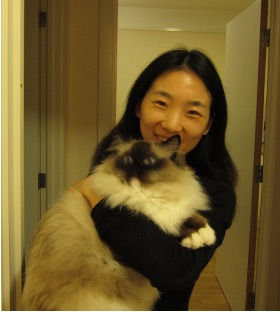

---
# Feel free to add content and custom Front Matter to this file.
# To modify the layout, see https://jekyllrb.com/docs/themes/#overriding-theme-defaults
# Welcome to my website!
layout: home
---

# 
 <b>Li Zhang</b> 

<!-- ### 
Welcom to my personal webpage!
 -->
## **About Me**
I am an associate lecturer in Finance and Technology of Institute(IFT),  University College London. Prior to  joining IFT, I was a postdoc in the Machine Learning group at University of Oxford and worked with Prof. Xiaowen Dong, Prof. Janet Pierrehumbert and Dr. Isabelle Lorge. I obtained my PhD degree in the Department of Computer Science, Machine Learning Group, University of Sheffield and my supervisors are Prof. Haiping Lu and Prof. Nikos Aletras. 
 
My rsearch research focuses on machine learning, graph representation learning (GRL), and graph neural networks (GNNs) and related application on social network, financial network analysis. I serve as an program committee member of KDD, IJCAI, AAAI, ECML, WWW, WSDM.
<!-- [[Curriculum Vitae]](assets/NingZhang_CV.pdf)\ -->
 
**Contact**: ucesl07[at]ucl[dot]ac[dot]uk
 

<!--   
  -->

## **Recent publications and preprints**
- **STEntConv: Predicting Disagreement with Stance Detection and a Signed Graph Convolutional Network**\
Isabelle Lorge, **Li Zhang**, Xiaowen Dong, Janet B Pierrehumbert.\
The Joint International Conference on Computational Linguistics, Language Resources and Evaluation (COLING 2024)\
[[paper]](https://arxiv.org/pdf/2403.15885)[[Code]](https://github.com/isabellelorge/contradiction)

- **RA-Rec: An Efficient ID Representation Alignment Framework for LLM-based Recommendation (2024)**\
Xiaohan Yu, **Li Zhang**, Xin Zhao, Yue Wang, Zhongrui Ma.\
[[paper]](https://arxiv.org/pdf/2402.04527)

- **DGDNN: Decoupled graph diffusion neural network for stock movement prediction**\
Zinuo You, Zijian Shi, Hongbo Bo, John Cartlidge, **Li Zhang**, Yan Ge.\
The 16th International Conference on Agents and Artificial Intelligence (ICAART 2024)\
[[paper]](https://arxiv.org/pdf/2401.01846)

- **Trustworthiness-aware knowledge graph representation for recommendation**\
Yan Ge, Jun Ma, **Li Zhang**, Xiang Li, Haiping Lu.\
Knowledge-Based Systems (2023)\
[[paper]](https://www.sciencedirect.com/science/article/pii/S0950705123006159)

- **Predicting polarisation of dynamic social networks via graph auto-encoders**\
**Li Zhang**, Isabelle Lorge, Janet B Pierrehumbert, Xiaowen Dong.\
The International Conference for Computational Social Science (2023)\
<!-- [[paper]](https://www.sciencedirect.com/science/article/pii/S0950705123006159) -->

- **Knowledge-aware neural collective matrix factorization for cross-domain recommendation**\
Li Zhang, Yan Ge, Jun Ma, Jianmo Ni, Haiping Lu.\
SIGKDD Conference on Knowledge Discovery and Data Mining - Graph Representation Learning(KDD22-GRL)\
[[paper]](https://arxiv.org/pdf/2206.13255)

- **A gnn-based multi-task learning framework for personalized video search**\
**Li Zhang**, Lei Shi, Jiashu Zhao, Juan Yang, Tianshu Lyu, Dawei Yin, Haiping Lu.\
ACM International Conference on Web Search and Data Mining(WSDM 2022)\
[[paper]](https://dl.acm.org/doi/pdf/10.1145/3488560.3498507)

- **Node-Feature Convolution for Graph Convolutional Networks**\
**Li Zhang**, Heda Song, Nikolaos Aletras, Haiping Lu.\
Pattern Recognition(2022)\
[[paper]](https://www.sciencedirect.com/science/article/pii/S003132032200142X)

- **A Feature-Importance-Aware and Robust Aggregator for GCN**\
**Li Zhang**, Haiping Lu.\
The Conference on Information and Knowledge Management(CIKM 2020)\
[[paper]](https://dl.acm.org/doi/pdf/10.1145/3340531.3411983)

- **Hop-Hop Relation-aware Graph Neural Network**\
**Li Zhang**, Haiping Lu.\
The European Conference on Machine Learning and Principles and Practice of Knowledge Discovery in Databases\
Graph Embedding Mining Workshop (ECML PKDD-GRL 2020)

- **Learnable Aggregator for GCN**\
**Li Zhang**, Haiping Lu.\
Advances in Neural Information Processing Systems-Graph Representation Learning (NeurIPS-GRL 2019)\
[[paper]](https://dl.acm.org/doi/pdf/10.1145/3340531.3411983)

<!--  
  -->

## **Talks**
<!-- - Jun. 2021: [Attributed graph alignment](assets/publication/ISIT2021.pdf) at IEEE International Symposium on Information Theory;  -->
- **Learnable Aggregator for GCN**
- 2023 IC2S2: Predicting polarisation of dynamic social networks via graph auto-encoders \
- 2022 WSDM: A gnn-based multi-task learning framework for personalized video search \
- 2020 CIKM: A Feature-Importance-Aware and Robust Aggregator for GCN \
- 2020 ECML PKDD-GRL: Hop-Hop Relation-aware Graph Neural Network \ 
- 2019 CIKM-GRL: Node-Feature Convolution for Graph Convolutional Networks \

## **Teaching**
<!-- - Michaelmas term 2023, Probability and Statistics for Network Analysis -->
Spring 2018-2020: COM6012 Scalable Machine Learning 
Fall 2020: COM4509/6509 Machine Learning and Adaptive Intelligence

 
 
